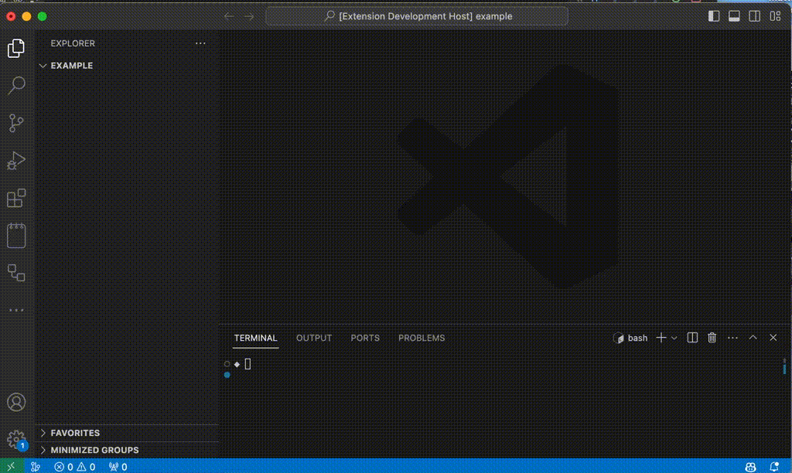

# File Template

[](https://marketplace.visualstudio.com/items?itemName=polymermallard.file-template)
[](https://marketplace.visualstudio.com/items?itemName=polymermallard.file-template)
[](https://www.patreon.com/mattkenefick)
[](https://paypal.me/polymermallard)

Creates a new file/folder structure from user-defined templates.



## Usage

Right click a file in the tree explorer and select "File Template: New" or using the action bar (_Cmd+Shift+P_)

You will be prompted for what template you want to create.

## Configuration

You can set custom variables, scripts, and template locations in settings. We automatically include variables related to your `process.env` and a `package.json` if there's one available.

To use `env` vars, you can include:

```
${env.HOME}
${env.PATH}
```

To use `package.json` vars, you can include:

```
${package.name}
${package.version}
```

### Custom Variables

Hardcoded variables with no special wrappings.

```
	"file-template.variables": {
		"${my-variable}": "Hello World."
	}
```

### Template Locations

Identify where templates can be found.

```
	"file-template.templateDirectories": [
		".vscode/templates",
		"$HOME/VSCodeTemplates"
	]
```

### Evaluated Code

You can also inline evaluated code to run in NodeJS, such as:

```
// Print date
${{ Date.now() }}

// Access variables from process.env, package, and anything user defined
${{ variables.package_version }}

// Special path variables
WORKSPACE: ${{ workspaceRoot }}
INPUT: ${{ inputPath }}
OUTPUT: ${{ outputPath }}
INPUT RELATIVE: ${{ inputPathRelative }}
OUTPUT RELATIVE: ${{ outputPathRelative }}
INPUT FILENAME: ${{ inputFilename }}
OUTPUT FILENAME: ${{ outputFilename }}

// Performing operations
${{
	const [major, minor, patch] = variables.package_version.split('.');

	`Major: ${major}\nMinor: ${minor}\nPatch: ${patch}`
}}

// Conditionals
${{
	if (variables.package_author.indexOf('Kenefick') > -1) {
		`It's Matt.`
	}
	else {
		`It's someone else.`
	}
}}
```


## Release Notes

### 0.1.0

Initial release
